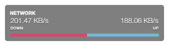

# Network Throughput

A simple Network Throughput widget for [Übersicht](http://tracesof.net/uebersicht) using the colors from [Monokai Faded](https://dionmunk.com/projects/monokai-faded/). The widget takes all of your available network connections and adds their upload and download speeds together and gives you a readout.

## Screenshot

## Installation

- Download the [repository](https://github.com/dionmunk/ubersicht-network-throughput/archive/master.zip) and extract it.
- Place the `network-throughput.widget` folder in your Übersicht extension folder.
- Refresh Übersicht.

## License

This work is licensed under a [Creative Commons Attribution-NonCommercial 4.0 International License](https://creativecommons.org/licenses/by-nc/4.0/).
